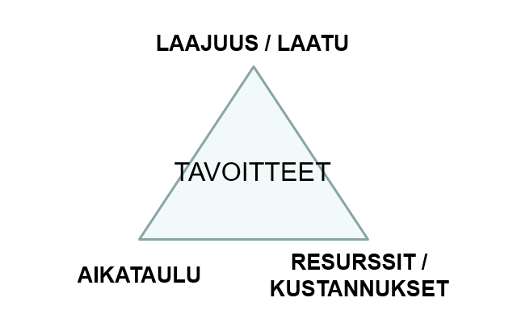
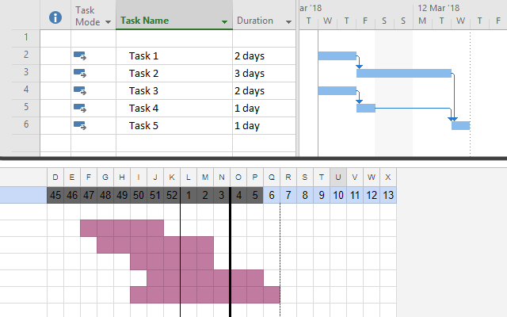

Created by Tatu Arvela under license EUPL 1.2.

# PRO1TN003 - Projektin johtaminen Projektisuunnittelun perusopas

Tämä dokumentti selittää projektien ja projektisuunnittelun perusperiaatteet, ja sopii erityisesti projektisuunnitelman tulkitsemiseen tai oppimateriaaliksi.

Opas on tehty Haaga-Helian kurssilla *Projektijohtaminen BUS8LH102* osana oppimistehtävää. Teksti on kirjoitettu Markdown-muodossa, ja löytyy muutamana eri versiona osoitteesta [github.com/tatuarvela/prosu](https://github.com/tatuarvela/prosu).

## Projektin käsite

### Mikä on projekti? Mikä ei ole projekti?

Sanaan "projekti" törmää useissa eri yhteyksissä, mutta termiä käytetään usein harhaanjohtavasti väärin. Varsinaisessa merkityksessään **projekti on tarkkaan suunniteltu hanke tietyn päämäärän saavuttamiseksi**.
Jokaisella projektilla onkin siis aina

* alku ja loppu
* aikataulu
* ainutkertainen, haastava tavoite

Projektilla on usein tavoiteltavana jokin sellainen päämäärä, johon liittyvät riskit ovat vaikeasti ennakoitavissa, ja johon tarvitaan erityistä osaamista ja luovuutta. Projekteissa on erilaisia toimintoja, jotka on suunniteltu tehtäväksi rinnakkain tai peräkkäin. Projekteille asetetaan erityisiä resursseja, kuten osaavia henkilöitä, työvälineitä ja rahaa, jotka kohdennetaan tavoitteiden saavuttamiseksi.

Projektilla on väliaikainen organisaatio, eli projektiryhmä, jota johtaa projektipäällikkö. Projektilla on myös erilaisia sidosryhmiä.

Ryhmätyöskentelyssa ei siis aina ole kyse projektista, vaan esimerkiksi hankkeesta, urakasta tai toimeksiannosta, jos ainutkertainen tavoite puuttuu, päämäärä on yksinkertainen tai tavoite toistuu. Valmiin projektin pohjalta voidaan joissakin tapauksissa muodostaa selkeä toistettava toimintamalli tai prosessi.

### Projektityön hyödyt ja haasteet

Projekti on tavoitteisiin orientoitunut kupla. Projektissa muodostetaan tilapäinen organisaatio, jossa pyritään jakamaan valta ja vastuut tavoitteiden mukaisesti. Projektit tarjoavat tekijöilleen tyypillisesti erikoisia ja haasteellisia tehtäviä, joissa korostuvat itsensä johtaminen ja vuorovaikutustaidot. Projekteissa pyritään tehokkaaseen työskentelyyn, selkeään tiedonkulkuun ja haluttujen tulosten saavuttamiseen.

Projekteille tyypillisesti haasteita tuottavat erityisesti aikatauluissa pysyminen ja tiedonkulku. Haasteita voivat tuottaa myös projektin tavoitteiden muutokset tai laajeneminen. Myöhästynyt projektin osa-alue saattaa pahimmillaan pysäyttää muiden osa-alueiden etenemisen kokonaan. Projektiryhmän jäsenten tulisi välttää liian monen projektin tekemistä yhtä aikaa, tai ajanhallinnan ongelmat saattavat jopa periytyä projektilta toiselle.

Vuonna 2017 Olivier Mesly julkaisi tutkimuksen, jonka mukaan projektin menestykseen vaikuttaisivat erityisesti **"4 P:tä"**:

* **Plan (suunnitelma):** Suunnittelu ja ennustus
* **Process (prosessi):** Lähestymistapa ja hallinta
* **People (ihmiset):** Ryhmädynamiikka ja kommunikaatio
* **Power (valta):** Auktoriteetit, päätöksentekijät ja politiikat

## Projektisuunnitelma

Projektisuunnitelma on elävä, virallinen dokumentti, jonka avulla projektia seurataan ja hallitaan. Projektisuunnitelma sisältää seuraavat osat:

* Kansilehti (projekti, projektipäällikkö)
* Versiohistoria (voi olla myös versionhallinnassa)
* Sisällysluettelo
* Liitedokumenttiluettelo
  * Päätä case-by-case mitkä osat laitat erillisiksi liitteiksi, ja mitkä osaksi projektisuunnitelmaa

Projektisuunnitelman sisältö voi olla esimerkiksi:

1. Johdanto
2. Tavoitteet
3. Organisaatio ja ohjausmalli
4. Projektin vaiheet ja menettelytavat
5. Viestintäsuunnitelma
6. Projektin kustannukset, projektin budjetti
7. Projektin riskit
8. Projektin dokumentaatio
9. Muutosten hallinta

Näistä viestintäsuunnitelma, kustannukset, riskit ja dokumentaatio ovat usein erillisiä dokumenttejaan.

## Projektin päämäärä, tavoitteet ja rajaukset

Projekti lähtee päämäärästä. Päämäärä voi olla esimerkiksi uuden CRM-järjestelmän käyttöönotto, tai yrityksen muutto uuteen toimitilaan.

Projektin tavoitteet selventävät päämäärän merkitystä, ja auttavat projektin saavutusten todentamisessa. Esimerkiksi yritysmuutossa tavoitteita voisivat olla

* yritys poistuu kokonaisuudessaan lähtöpaikasta
* yritys siirtyy kokonaisuudessaan määränpäähän
* yrityksen toiminta jatkuu muuton ajan
* muuton kustannukset pysyvät kohtuullisina
* muutolla saavutetaan lisää toimitilaa

Projektia rajoittavia tekijöitä kuvataan niin sanottuna **projektikolmiona**, josta on olemassa erilaisia versioita. Tässä on kurssilla käsitelty versio, jossa projektin tavoitteita rajoittavat seuraavat muuttujat:

* **Laajuus / Laatu**
* **Aikataulu**
* **Resurssit / Kustannukset**

Hyvä tavoite on:

* mitattavissa
* saavutettavissa
* päämäärälle relevantti
* hyödyllinen tai tarpeellinen

Projektilla on myös oltava rajauksia, eli selvennys niistä asioista jotka eivät kuulu projektiin. Rajauksilla pidetään fokus projektin päämäärässä. Liiketoimintauudistuksesta saatettaisiin rajata pois vaikkapa uudistukseen liittyvä markkinointi.

## Ositus ja aikataulutus

Projektin rakenne on muodostettava osiksi, jotta projektille voidaan jakaa selkeiksi tehtäviksi. Projekti ositetaan 3-5 keskeisimpään osaan, jotka puolestaan voivat jakautua yhä pienempiin osiin. Projekti voi olla jakautunut myös eri vaiheisiin, kuten esimerkiksi

* suunnittelu
* toteutus
* arviointi

Ositus voi olla suuren kokonaisuuden pilkkomista pienemmiksi, tai pienten osien kokoamista suuremmiksi. Osat voivat olla aikajanalla sekä peräkkäisiä että rinnakkaisia. Ositus voi liittyä esimerkiksi

* projektin vaiheisiin
* yrityksen osastoihin
* projektin sijainteihin
* eri työlajeihin (esim. suunnittelu, asennus, tarkastus).

Asiakastyytyväisyyskyselyprojektissa ositus voisi olla seuraavanlainen:

* kyselyn suunnittelu
  * ulkoasu
  * kysymykset
* vastausten kerääminen
* vastausten analysointi
* raportointi

Rakennusprojektissa ositus voisi puolestaan olla ehkä jotain tällaista:

* suunnittelu
  * rakennuksen malli
  * vesiputket
  * ilmastointi
  * sähköt
  * pintamateriaalit
* lupa-asiat
  * rakennuslupa
* rakentaminen
  * perustukset
  * ulkoseinät
  * vesiputket
  * sähköt
  * ilmastointi
  * sisäpinnat
* viimeistely
  * loppusiivous
  * tarkastukset

Ositus auttaa

* hahmottamaan projektin kokonaisuutta
* arvioimaan kustannuksia
* määrittämään projektin välietappeja

Osituksessa muodostetaan myös *milestoneja* tai *"go / no go"*-vaiheita, joissa tarkistetaan että projektissa on saavutettu tarvittavat 

**Gantt-kaaviota** käytetään kuvaamaan projektin ositusta ja aikataulutusta. Kaavion voi tehdä esimerkiksi millä tahansa taulukkolaskentaohjelmalla, tai erityisesti tehtävään tarkoitetulla Microsoft Projectilla, joka mahdollistaa muun muassa

* tehtävien linkityksen toisiinsa
* tehtävien automaattisen aikataulutuksen
* henkilöresurssien yhdistämisen tehtäviin

Projektille on määriteltävä myös **kriittinen polku**, eli niiden peräkkäin suoritettavien asioiden kokonaisuus, jotka on toteutettava aikataulussa, jotta koko projekti ei myöhästyisi.

## Tyypit, mallit ja lähestymistavat

Jokainen projekti on erilainen. Projekteja ovat esimerkiksi

* markkinointikampanja
* rakennusprojekti
* IT-ratkaisun toimittaminen asiakkaalle
* oman liiketoiminnan investointiprojekti
* tuotekehitysprojekti
* tutkimusprojekti

Projekti voi olla:

* pieni tai suuri
* helpohko tai erityisen haastava
* yrityksen, julkishallinnon tai molempien projekti
* rakennusprojekti, it-projekti, liiketoimintaprojekti, tuotantoprojekti tai tutkimusprojekti

Yhden kiinnostavan projektien luokittelun on luonut Eddie Obengin perustama Pentacle:

|                     | Don't know how     | Know how            |
| ------------------- | :----------------: | :-----------------: |
| **Know what**       | Going on a quest   | Painting by numbers |
| **Don't know what** | Walking in the fog | Making a movie      |

Projektien hallintaan on erilaisia valmiita malleja, joista tässä pari esimerkkiä:

* PRINCE2: Prosessipainotteinen, teoreettinen ja suuriin projekteihin skaalautuva yleiskäyttöinen projektien hallintamenetelmä, joka on alun perin tarkoitettu Iso-Britannian valtiollisten it-hankkeiden hallintaan. Menetelmä on laajasti käytössä.
* Ketterät menetelmät: Erityisesti ohjelmistokehityksen tarpeisiin on syntynyt useita erilaisia projektien viitekehyksiä, jotka pyrkivät nopeisiin iteraatioihin kehitettävästä tuotoksesta. Menetelmistä ensimmäinen on Toyotan kehittämä Kanban, jota ovat seuranneet Agile, Scrum, Scrumban, Lean, Extreme Programming ja lukuisat muut. Kiteytettynä näiden menetelmien pyrkimyksenä on keskittyä tekemään sitä, mikä on milloinkin tärkeää ja tarpeellista.

## Organisaatio ja sidosryhmät

Projektilla on jokin erityisosaamisesta koostuva organisaatio, jota johtaa projektipäällikkö. Projektipäälliköllä on tai ei ole esimiesvaltaa projektista riippuen, mutta projektipäälliköllä on kuitenkin yleensä erityisiä projektiin liittyviä valtuuksia esimerkiksi päättää työtehtävistä, kokouksista ja aikatauluista. Projektin organisaatiomalli voi olla esimerkiksi perinteinen linjaorganisaatio. Projektiorganisaation kuvaus kertoo

* mitä rooleja projektissa on
* kuka on mistäkin vastuussa
* kuka on mihinkin valtuutettu
* kuka raportoi mitä ja kenelle

Projektin rakenteessa voi olla projektista riippuen eri tasoja:

* johtoryhmä, joka vastaa esimerkiksi projektin lisäresursseista
* ohjausryhmä, joka tukee projektipäällikköä 
* projektipäällikkö, joka vie projektia eteenpäin, päättää toteutuksen linjoista ja seuraa projektin etenemistä
* toteutusryhmä, joka toteuttaa projektin tehtävät ja mahdollisesti päättää joistakin asioista

Projektia voidaan pilkkoa myös osaprojekteiksi, joille asetetaan omia projektipäälliköitään. Alihankkijoita hyödyntävissä projekteissa muodostuu usein myös sisarprojekteja.

Projektilla on sidosryhmiä, eli tahoja, jotka

* asettavat tavoitteita
* antavat resursseja, rahoittavat
* odottavat tuloksia, käyttävät lopputuotosta

Sidosryhmiä voivat olla esimerkiksi

* tilaaja
* projektiryhmän esimiehet
* asiakkaat
* yrityksen henkilöstö
* alihankkijat

Sidosryhmät vaikuttavat projektin

* viestintään
* muutostenhallintaan
* riskienhallintaan

### RACI-matriisi

RACI on projektinhallinnan työkalu, joka kertoo mitä tehdään, kuka tekee ja mihin mennessä.

* R = responsible (vastuullinen)
* A = accountable (vastuussa oleva)
* C = consulted (neuvoja)
* I = informed (tiedotettava)

| Tehtävä       | Henkilö A | Henkilö B | Henkilö C |
| ------------- | --------- | --------- | --------- |
| **Tehtävä 1** | I         | A/R       | C         |
| **Tehtävä 2** | A/R       | I         | I         |
| **Tehtävä 3** | I         |           | A/R       |
| **Tehtävä 4** | I         | C         | R         |

## Riskienhallinta

Projektissa on tärkeää tunnistaa mahdolliset riskit, ja muodostaa toimintasuunnitelma niiden varalle. Projektisuunnitelmassa on tärkeää kertoa periaatteet, miten projektissa seurataan ja hallitaan riskejä.

Riskien hallinnan prosessi on esimerkiksi seuraavanlainen:

1. Tunnista mahdolliset riskit ja listaa ne
2. Arvioi kunkin riskin vakavuusaste ja todennäköisyys toteutumiselle. Riskin kokonaisvaikuttavuus on vakavuus ja todennäköisyys kerrottuna keskenään
3. Päätä minkä tason riskeille teet toimenpidesuunnitelmat
4. Tee toimenpidesuunnitelmat ja seurantasuunnitelmat

## Kustannukset

Projektin toteuttaminen vaatii resursseja, eli rahaa. Kustannusarvio laaditaan arvioiden projektin tarpeet mahdollisimman tarkasti. Ennakkoon voi olla haastavaa arvioida esimerkiksi palkkakustannuksia, mutta on tärkeää laatia edes jonkinlainen arvio. Kustannusarviossa on otettava huomioon myös projektin tuotto-odotukset. Asiakasprojektissa on muistettava, että hinnoittelu on eri asia kuin kustannusarvio!

Listaa projektin kustannusarvioon projektin työt ja kunkin kustannus. Kustannusarvion voi myös kuvata aikataulunäkymässä. Tavallisesti projektin kustannukset kasvavat projektin loppua kohden, ja sitten putoavat. Kustannukset jakautuvat kustannustyyppeihin. Projektin kustannustyyppejä voivat olla esimerkiksi:

* suorat kustannukset
  * palkat
  * sivukulut
  * laitehankinnat
  * materiaali
  * alihankinnat
  * matkat, edustus, huvi
  * rahoituskulut (projektin toteuttaminen voi vaatia lainaa tai rahoitusta)
* yleiskustannukset
  * tuotekehitys
  * hallinto
  * pääoma
  * kiinteistön kustannukset
* tuottotavoite
* ALV

Projektin kustannuksia on tärkeää seurata, sillä ne tarkentuvat ja muuttuvat projektin aikana. Kustannuksissa voi tulla rajua kasvua, toisaalta joskus myös laskuakin.

## Muutostenhallinta

Projektissa tulee suurella varmuudella tapahtumaan joitakin muutoksia, ja siksi niiden varalta on oltava toimintasuunnitelmat.

* Mistä voi aiheutua muutoksia?
  * Suunnitteluvirhe
  * Tavoitteen muuttuminen
  * Työmenetelmien muuttuminen
  * Henkilömuutokset
* Mihin muutokset voivat vaikuttaa?
  * Aikatauluun
  * Tavoitteeseen
  * Sisältöön
  * Laatuun
  * Hintaan
  * Kustannuksiin
* Miten muutoksiin pitäisi suhtautua?
* Minkälaiset asiat auttavat selviämään muutoksista?
* Miten muutokset hyväksytään ja viedään suunnitteludokumentteihin?
* Asiakasprojekteissa muutokset on otettava huomioon jo sopimuksessa!

Jos muutoksia tapahtuu paljon, on mahdollista etteivät projektin lähtökohdat ole kunnossa. Tällöin projekti on syytä lopettaa ja suunnitella uudelleen, mikäli projektille on yhä tarve.

## Projektin viestintäsuunnitelma

Projektityöhön kuuluu myös viestintää, niin projektin sisällä kuin eri sidosryhmille. Projektille on siis muodostettava viestintäsuunnitelma, jossa listataan projektin käytännöt liittyen

* ulkoiseen viestintään
* yrityksen sisäiseen viestintään
* projektitiimin sisäiseen viestintään
* kahdenkeskiseen viestintään
* viestintään sidosryhmille

Viestintäsuunnitelmassa kerrotaan

* mitä viestitään
* kenelle viestitään
* milloin viestitään
* mitä kanavia käyttäen viestitään

Projektissa voidaan käyttää viestintään esimerkiksi sähköpostia, ryhmäpuheluita tai pikaviestimiä. Viestintäsuunnitelmaan liittyy myös esimerkiksi dokumenttien jakokäytännöt ja -kanavat.

## Hyväksyntä ja lopetus

Kun projektin tehtävät on tehty, tai päämäärä saavutettu, on syytä päättää projekti. Ensin on kuitenkin arvioitava projektin saavuttamat tavoitteet ja lopputulos, ja sitä varten on projektisuunnitelmaan oltava listattuna projektin hyväksymiskriteerit. Hyväksymiskriteerit voivat koskea esimerkiksi projektin saavuttamia kustannussäästöjä tai luodun palvelun käytettävyyttä. Jos hyväksymiskriteerit eivät täyty, voidaan projektia jatkaa, aloittaa uusi projekti tai siirtyä toisenlaiseen toimintamalliin.

Projektisuunnitelmaan liitetään myös loppuraportin pohja, sisältö ja tarkoitus (mihin käyttöön ja kenelle?), sekä projektin päättämiseen liittyvät toiminnot. Projektin päättymiseen voi liittyä esimerkiksi auditointeja, ylläpidollisia toimenpiteitä tai jotain muuta.
